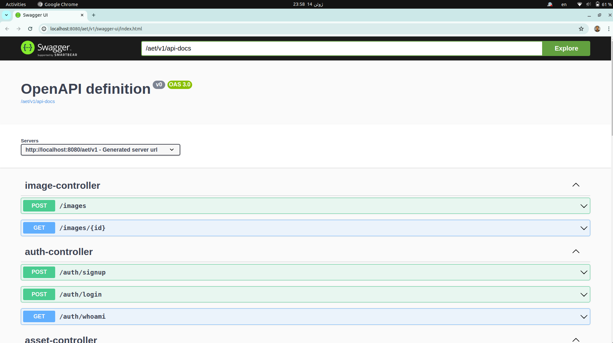
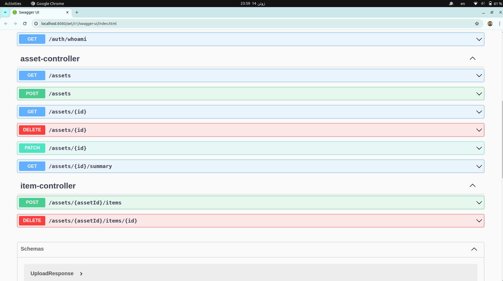
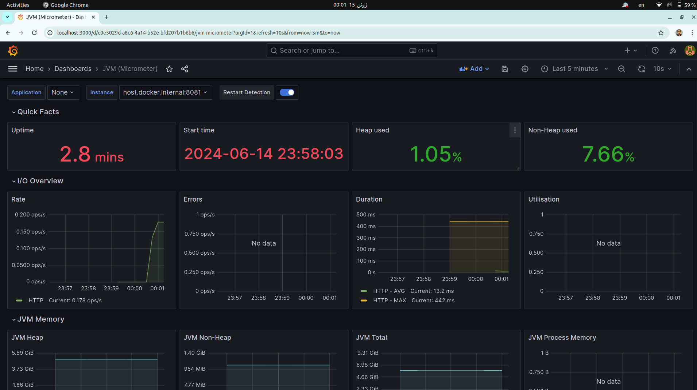
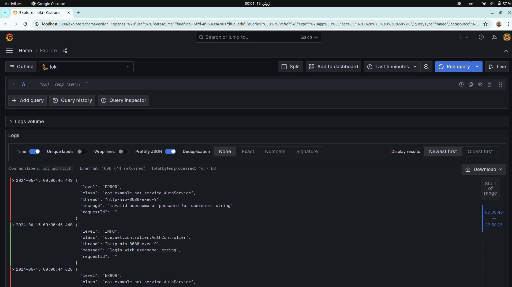

# Asset and Expense Tracker(AET)

This project's main focus is on learning and using spring boot as the backend.

You can add and track your assets and check the total amount, total cost and 
calculate gain/loss.

## Demo

### Swagger UI



### Grafana



## API Documentation

You can check swagger UI for APIs here:

http://localhost:8080/aet/v1/swagger-ui/index.html

## Usage

### Requirements:
 - Java OpenJDK v21
 - MongoDB v5
 - Docker
 - Maven


### Docker Compose

If you are using Intellij, run the project using maven profiles and check
`compose` profile.


Or before starting the project, load the services by docker compose:

```bash
docker compose up -d
```

If wanted to stop the services:
```bash
docker compose down
```

### Build
Build the project using maven:
```bash
mvn clean package
```

### Run
Make sure before running the project, use the correct credentials for MongoDB in the proper
profile (if running locally, update `application-local.properties`)

Activate the local profile of spring boot and run the jar file:

```bash
java -jar -Dspring.profiles.active=local ./target/aet-0.0.1-SNAPSHOT.jar
```

## Observability

You can check the visualized data about metrics and logs in grafana dashboard in:

`http://localhost:3000`

**Note**: Default username is `admin` and default password is `admin`  


## Features
- Spring Security and JWT authentication
- Observability using Grafana, Prometheus, and Loki
- Spring Boot Docker Compose plugin
- Exception Handling by RFC 7807 specification
- Lombok
